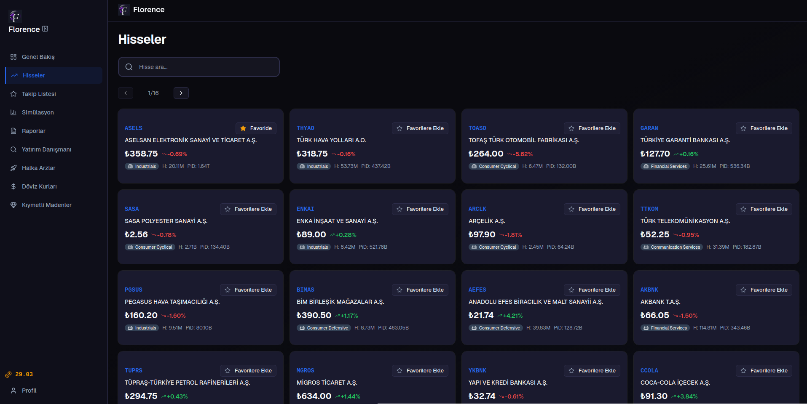

  <picture>
    
  </picture>

<h1 align="center">Florence</h1>

  <strong>Akıllı Yatırım Asistanı</strong> — Gerçek zamanlı piyasa verileri, yapay zekâ destekli analizler ve sanal portföy yönetimi.

  

---

Florence; hisse senetleri, döviz kurları, kıymetli metaller ve makroekonomik göstergeleri tek bir ekranda takip edebileceğiniz akıllı bir yatırım asistanıdır. Gerçek zamanlı piyasa verilerini yapay zekâ destekli analizlerle birleştirir; simülasyonlar yapmanıza, otomatik raporlar üretmenize ve sanal portföylerinizi yönetmenize olanak tanır.

## Özellikler

- **📊 Pazar Panosu** — Hisse senetleri, döviz kurları, kıymetli metaller ve makroekonomik göstergeler anlık olarak
- **🤖 Yapay Zekâ Danışmanı** — Portföyünüze ve risk profilinize göre akıllı öneriler
- **📈 Etkileşimli Grafikler** — Çoklu zaman dilimi ve aralık desteğiyle mum grafikleri
- **📄 Otomatik Raporlar** — Temel analiz, haber duyarlılığı ve strateji değerlendirme raporları
- **🎮 Pazar Simülasyonları** — Stratejilerinizi gelişmiş simülasyon modelleriyle test edin
- **💰 Sanal Portföyler** — Portföy oluşturun, performansınızı XU100 ile karşılaştırın
- **📋 Takip Listesi** — İzlediğiniz hisseleri gerçek zamanlı fiyatlarla tek ekranda
- **📢 Duyurular** — Yönetici duyuruları ve anlık bildirimler
- **🌐 Çok Dilli Arayüz** — Türkçe ve İngilizce destek
- **🎨 Temalar** — El yapımı 6 farklı tema (Florence, Ocean, Emerald, Midnight, Sunset, Light)

---

Bu depo, Florence'ın web arayüzünü içerir. API sunucusu için [project-florence/backend](https://github.com/project-florence/backend) deposuna, platformun tamamı için [project-florence organizasyon sayfasına](https://github.com/project-florence) göz atın.

İngilizce sürüm: [English](docs/README.en.md)

## Lisans

Apache License 2.0
